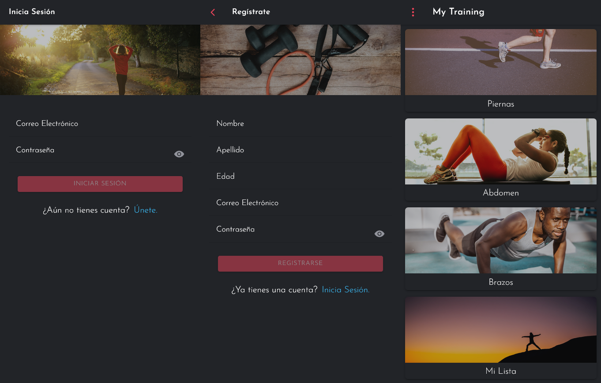
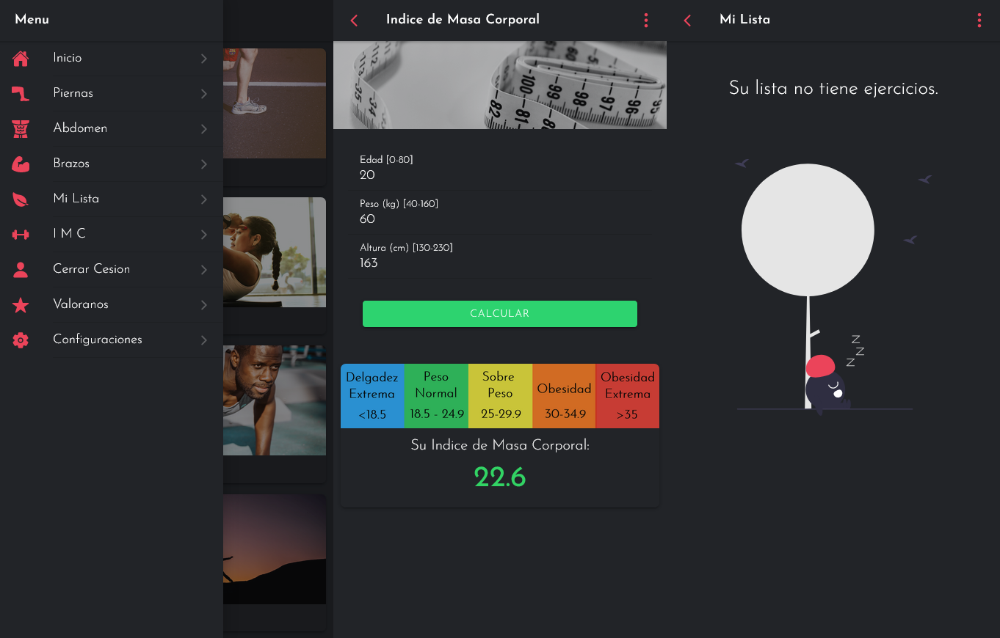
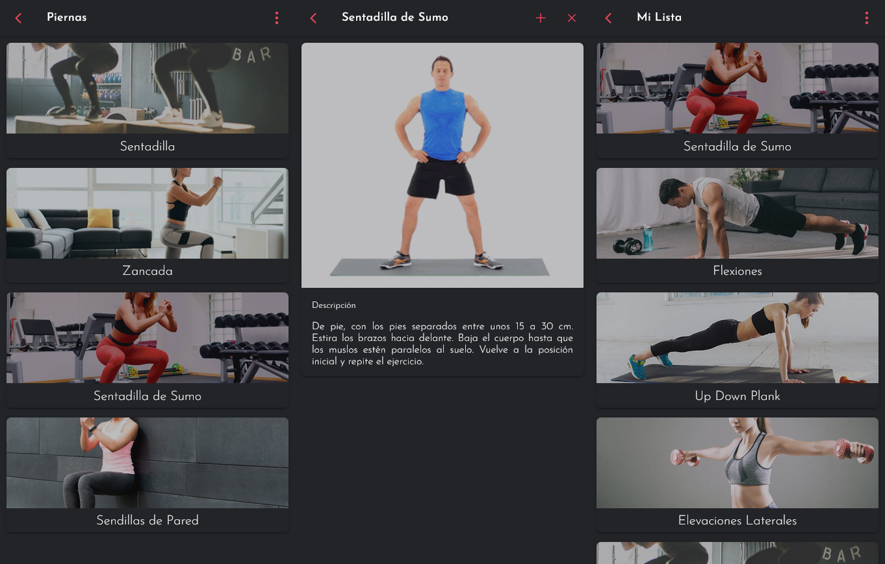

# My-Training 
Aplicación móvil para fomentar la actividad física en lo cual ==>
  - Podras ver diferentes ejercicios para tu cuerpo.
  - Podras calcular tu IMC, es decir tu índice de masa corporal y por ultimo.
  - Podras tener una lista de tus ejercicios preferidos.


## Importante 
Debe remplazar SRC dentro de una aplicación de IONIC-ANGULAR, ojo también usted debera instalar dentro de la carpeta de la aplicación mediante el CMD lo que sale a continuacion:

```bash
npm install @ionic/storage
```
```bash
npm install @ionic/storage-angular
```

Solo queda levantar el servidor escribiendo en la coonsola este comando:

- Navegador
```bash
ionic serve
```
- Móvil
```bash
ionic serve --lab
```





Proyect My Training realizado junto a mi compañero Armando Neira.
